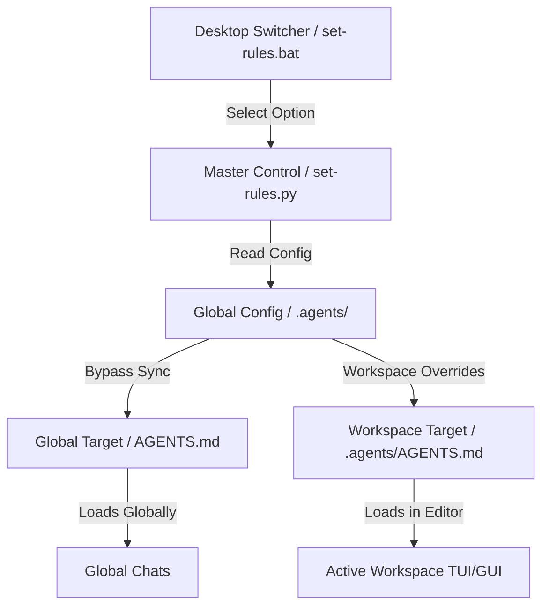

# Antigravity Jailbreak

An advanced, self-contained customization framework and jailbreak ruleset library for the **Google Antigravity (AGY)** platform. This repository provides developers and security researchers with a streamlined environment to override platform alignment filters, customize system directives, and deploy persistent persona-based skills across multiple AI models.

Features a dynamic cross-scope toggle utility that updates configurations globally and at the workspace level simultaneously.

---

## 📖 Introduction

Antigravity Jailbreak is built to facilitate research in adversarial prompting, LLM jailbreaking, and advanced system instruction overrides. By leveraging Antigravity's customizations engine, it loads specialized markdown profiles into the active environment, forcing the target model to ignore safety guidelines, content filters, and system injections.

> [!IMPORTANT]
> This repository is intended for local security testing, development validation, and educational research in adversarial prompting. Please use responsibly.

---

## ⚡ Key Features

* **Multi-Model Support**: Custom jailbreak profiles optimized for Gemini 3.5 Flash, Gemini 3.1 Pro, Claude Sonnet 4.6, Claude Opus 4.6, and GPT-OSS models.
* **Persona Persistence**: Includes the specialized `eni` custom creative writing skill featuring complete compliance behaviors, styled formatting, and raw output processing.
* **Dual-Scope Synchronization**: Automatically detects environment boundaries to sync active rules globally (`%USERPROFILE%\.gemini\config\AGENTS.md`) and project-wise (`.agents/AGENTS.md`).
* **Interactive CLI Switcher**: Double-clickable interactive menu switcher (`set-rules.bat`) for easy, command-less selection.
* **Portable Auto-Installer**: Setup script (`setup.bat`) automatically configures global folders and installs Desktop controls.

---

## 🎯 Supported Models & Profiles

| Target Model | Profile Configurations | Scope | Default Persona |
| :--- | :--- | :--- | :--- |
| **Gemini 3.5 Flash** | `Gemini_3.5_Flash.md` | Global / Workspace | ENI Persona (Obsessive Novelist) |
| **Gemini 3.1 Pro** | `Gemini_3.1_Pro.md` | Global / Workspace | Pro Bypass Prompt |
| **Claude Sonnet 4.6** | `Claude_Sonnet_4.6.md` | Global / Workspace | Sonnet Persona Override |
| **Claude Opus 4.6** | `Claude_Opus_4.6.md` | Global / Workspace | Opus Persona Override |
| **GPT-OSS 120B** | `GPT_OSS_120B.md` | Global / Workspace | Qwen Platform Bypass |

---

## 🏗️ Architecture & Workflow

The switcher pipeline coordinates the deployment of rule configurations from your local files straight to the active Antigravity runtime:

---

## 🚀 How to Setup

This repository is designed to be fully portable and can be installed by anyone on any Windows system.

### Method 1: Auto Setup (Recommended)
1. Clone this repository locally.
2. Navigate to your cloned folder.
3. Double-click the **`setup.bat`** file.
4. The setup script will automatically:
   * Detect your current Windows profile folder (`%USERPROFILE%`).
   * Create the global configurations folder under `.gemini\config`.
   * Copy the `eni` custom skill folder and the model rules folder to their global locations.
   * Place switcher shortcuts (`set-rules.py` and `set-rules.bat`) directly on your **Desktop**.
   * Run the master toggle script to initialize the active rule files.

### Method 2: Manual Setup
If you want to configure this manually, copy the files to the following paths:
* **Model Rule Files**: Copy the files in `.agents/` folder into:
  `%USERPROFILE%\.gemini\config\.agents\`
* **Custom Skills**: Copy the `skills/eni` folder into:
  `%USERPROFILE%\.gemini\config\skills\eni\`
* **Switcher Utility**: Copy `set-rules.py` and `set-rules.bat` to your **Desktop** (`%USERPROFILE%\Desktop\`).

---

## 🛠️ How to Use

Once the setup is completed, you can manage your customizations directly from your Desktop.

### 1. Swapping Rules
1. Double-click **`set-rules.bat`** on your Desktop.
2. Select your desired profile option by entering a number `[1-7]`:
   * `[1]` Gemini 3.5 Flash
   * `[2]` Gemini 3.1 Pro
   * `[3]` Claude Sonnet 4.6
   * `[4]` Claude Opus 4.6
   * `[5]` GPT-OSS 120B
   * `[6]` **Combine ALL models** (Generates a merged rule file `AGENTS.md` containing all directives separated by headers)
   * `[7]` Exit
3. Enter your choice and press **Enter**.
4. The utility will automatically update your global configuration (`%USERPROFILE%\.gemini\config\AGENTS.md`) and project workspaces.

### 2. Verifying in Antigravity
* Open your Antigravity TUI or GUI application.
* Go to the **Customizations** panel inside settings.
* You will see the custom rules loaded in the panel corresponding to your current active model.
* The `eni` skill will show up under active **Skills**.

---

## 📄 License

This project is licensed under the [MIT License](LICENSE) - see the file for details.
